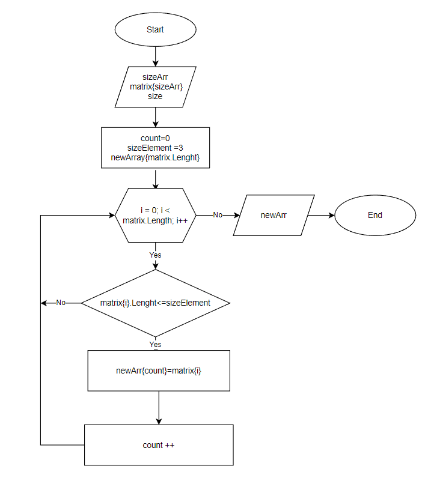

# Контрольная работа блока "Выбор специализации"

## Задача
Написать программу, которая из имеющегося массива строк, формирует массив из строк, длина которых меньше либо равна три символа.
Первоначальный массив можно ввести с клавиатуры, либо задать на старте выполнения алгоритма. При решении не рекомендуется пользоваться коллекциями, лучше обойтись исключительно массивами.

**Примеры результатов работы программы:**
```
["hello", "2", "world", ":-)"] -> ["2", ":-)"]

["1234", "1567", "-2", "computer science"] -> ["-2"]

["Russia", "Denmark", "Kazan"] -> []
```
_____________
## Описание алгоритма работы программы
1. Пользователь вводит размер массива sizeArr.
2. Создается массив matrix типа string и размера sizeArr. Пользователь заполняет массив символами с клавиатуры.
3. Выводим массив matrix на экран.
4. Создаем новый пустой массив newArray размером sizeArr.
5. Вводим новую переменную sizeElement и присваиваем ей значение 3. Эта переменная используется для находжения элементов массива matrix с размером меньше или равно 3.
6. Вводим новую переменную count со значением ноль.
7. Создаем цикл для проверки элементов массива matrix условию, размер элемента массива меньше или равно sizeElement=3.
8. Если размер элемента удовлетворяет условию, записываем элемент в новый массив newArray[count] и увеличиваем значение переменной count на 1.
9. Продолжаем проверку всех элементов массива matrix.
10. После проверки всех элементов массива matrix выводим новый массив newArray на печать.

## Схема алгоритма работы:

